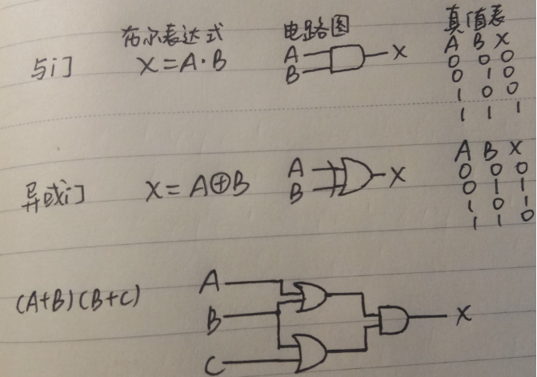
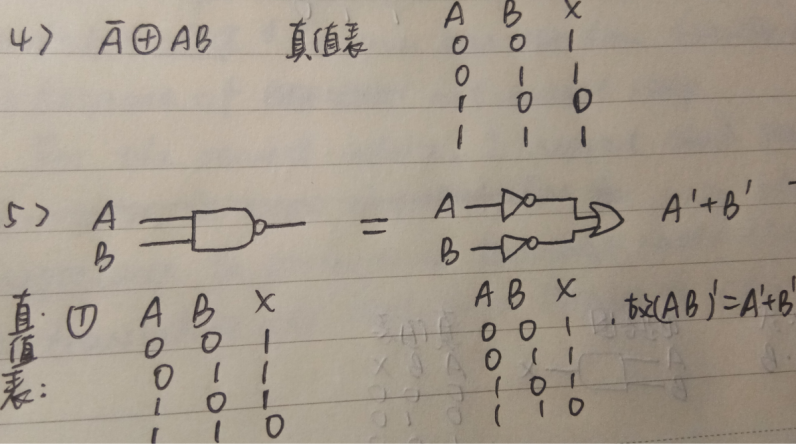
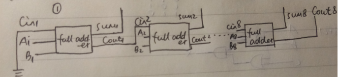
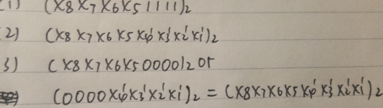

# 作业
**Part1**
* 1）2) 3) 
 

* .4) 5) 
 

**Part2**
* .6) 
 
从左到右，sum1到sum8分别是个十。。（也就是从小到大），最后Cout8输出判断两个数相加是否会进位，总共要输出9位。 
* .7) 

 

**Part3**
* .1)Logic gate:In electronics, a logic gate is an idealized or physical device implementing a Boolean function; that is, it performs a logical operation on one or more binary inputs and produces a single binary output.
* 中文翻译：在电子学中，逻辑门是实现布尔函数的理想化或物理设备; 也就是说，它对一个或多个二进制输入执行逻辑运算并产生单个二进制输出
* .2)Boolean algebra:In mathematics and mathematical logic, Boolean algebra is the branch of algebra in which the values of the variables are the truth values true and false, usually denoted 1 and 0 respectively.
* 中文翻译：在数学和数学逻辑，布尔代数是的分支代数，其中的值的变量是真值 真和假，通常分别表示为1和0。

* 1）Flip-flop：触发器
* 2）two