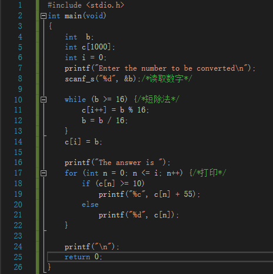

1 阅读 Pseudocode Standard
1. 用伪代码描述将十进制转换成16进制的方法
Write "Enter the number to be converted"
Read decimalNumber
Set answer to 0
Set quotient to decimalNumber
WHILE (quotient is not zero)
Set quotient to decimalNumber DIV 16
Set remainder to decimalNumber REM 16
Make the remainder the next digit to the left in the answer
Set decimalNumber to quotient
Write "The answer is",answer
2. C语言实现（先用注释写好算法，然翻译）

3. 使用 -1, 0, 1, 15, 26， 3265 最为输入测试你的程序
Enter the number to be converted
-1
The answer is -1
Enter the number to be converted
0
The answer is 0
Enter the number to be converted
1
The answer is 1
Enter the number to be converted
15
The answer is F
Enter the number to be converted
26
The answer is A1
Enter the number to be converted
3265
The answer is 1CC
2 名词解释与对比
1. Top-down design
A top-down approach (also known as stepwise design and in some cases used as a synonym of decomposition) is essentially the breaking down of a system to gain insight into its compositional sub-systems in a reverse engineering fashion.
2. Work breakdown structure (WBS)
A work breakdown structure (WBS), in project management and systems engineering, is a deliverable-oriented decomposition of a project into smaller components. A work breakdown structure is a key project deliverable that organizes the team's work into manageable sections.
3. 简述管理学 WBS 与 信息学 Top-down设计 的异同
同：breaking down of a system to gain insight into its compositional sub-systems
异：WBS 将主体目标逐步细化分解成为一个个微小的日常活动事件，此类事件可直接分派到个人去完成；每个任务原则上要求分解到不能再细分为止；日常活动有完整的细节，如对象、时间等。
Top-down design 要求工作个体对所设计的系统要有一个全面的理解，然后从顶层开始,不间断地逐层向下分解任务,直到系统的所有模块都便于掌握。
3
仔细观察您洗衣机的运作过程,运用Top-down设计方法和Pseudocode 描述洗衣机控制程序。假设洗衣机可执行的基本操作如下：
waterinswitch(openclose) // open 打开上水开关， close关闭 wateroutswitch(openclose) // open 打开排水开关， close关闭 getwatervolume() //返回洗衣机内部水的高度 **motorrun(direction) *// 电机转动。 left左转， right右转， stop停 timecounter() // 返回当前时间计数，以秒为单位 *halt(returncode) **//停机， success 成功 failure 失败
1. 请使用伪代码分解“正常洗衣”程序的大步骤。包括注水、浸泡等
set the water in >> soap the clothes >> wash the clothes >> dewatering the clothes >> stop the work
注水 >> 浸泡 >> 洗涤和漂洗 >> 脱水 >> 停机
2. 进一步用基本操作、控制语句（IF、 FOR、 WHILE等）、变量与表达式，写出每 个步骤的伪代码
注水：
turn on the water_in_switch
set the water volume
while(water_input is less than the water volume)
keep the water_in_switch open
while(water_input is more than the water volume or volume timeout)
stop input water
浸泡
set the soaping time
for(set the left time is zero ;the left time is less than the setting time; increase the left time)
keep the clothes soaping
if(the left time is equal to the setting time)
begin to wash
洗涤和漂洗
set the washing times to 3
set the washing time to 20
for(set a to zero; a is less than setting times; add 1 to a;)
if(the washing times is not the 1st time)
pouring the water
pouring in the new and clean water
do
washing and motor runs
while(the pass time is less than the washing time)
pouring the water
脱水
set the motor run's frequency
set the running time
while the past time is less than the running time
keep the motor running in the setting frequency
3. 根据你的实践，请分析“正常洗衣”与“快速洗衣” 在用户目标和程序上的异同。 你认为是否存在改进（创新）空间，简单说明你的改进意见？
快速洗衣和正常洗衣都完成了基本的洗衣流程，用户的目标都是为了将衣服进行清洗。而快速洗衣，用户的目标是追求以较快的速度完成衣物的清洗，相对于正常洗衣而言，使用的时间较少，衣物的清洁度也较低。程序上，快速洗衣少了浸泡这一过程，这会影响到衣物的清洗效果。
改进意见：可适当缩短洗涤和漂洗之间的时间间隔，如每一次洗涤和漂洗的最后几分钟可以边漂洗边开始排水、进水，此时上一次的漂洗尚未完成，而不用等到一次漂洗完成后才排水，再放水进行下一次漂洗。这样可相对节省出部分时间，可用于衣物的浸泡或者进一步缩短快速洗衣时间。
4.通过步骤3），提取一些共性功能模块（函数），简化“正常洗衣”程序，使程序 变得更利于人类理解和修改维护。例如： wait(time) //等待指定的时间； 注水(volume,timeout) //在指定时间内完成注水，否则停机； 排水(timeout)。 等子程序
int wait(time)
set the waiting time
return the waiting time
int the washing(time)
set the washing time
return the washing time
int pour_out the water(timeout)
set the time
while the time is over
stop pouring
int pour_in the water(volume,timeout)
set the time
while the time is over
stop pouring