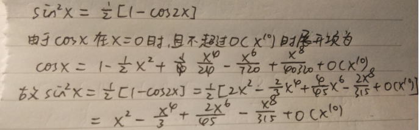
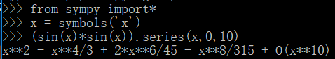
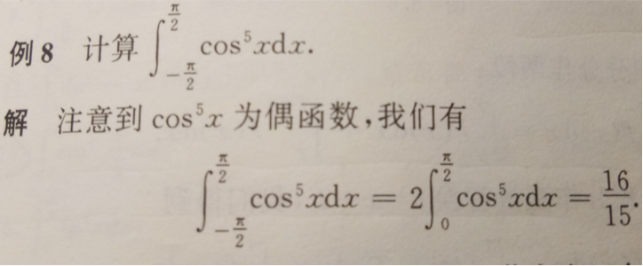
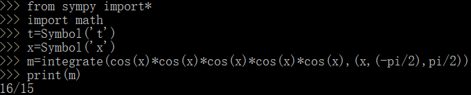
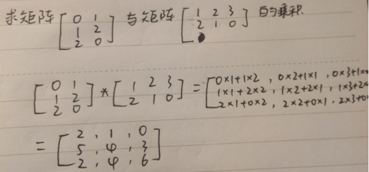
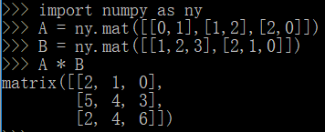
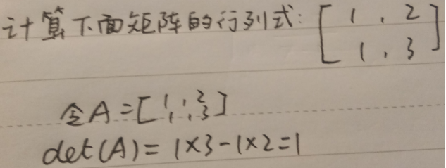
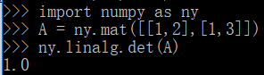

# python 编程实验报告
* <h1>高数:</h1>
*  1、计算sinx的平方在x = 0点      的，并且展开到O（x^10）项      的局部泰勒公式。
    先进行理论证明： 
   
   在Python上运行得到： 
   
   验证成功

* 2、求定积分 
   理论验证：
    
    在Python上运行得到： 
     

* <h1>线性代数:</h1>
   1、理论验证： 

     
   在Python上运行为： 
    

   2、理论验证： 

   
     
   在Python上运行为： 
    

   
