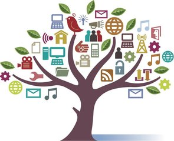

# 互联网时代的盈利模式之自媒体

* 当今世界，传统的信息获取方式已渐渐被互联网取代，报纸等纸质信息传输渐渐被电子期刊，微信公众号，微博等取代。随着这一发展，自媒体的世界渐渐发展，成为了如今互联网时代比较热门的盈利方式。
* 何为自媒体，按照wiki百科上的诠释意为：自媒体，是指私人化、平民化、普泛化、自主化的传播者以现代化、电子化的手段，向不特定的大多数或者特定的单个人传递规范性及非规范性信息的新媒体的总称。意指在网络技术；特别是Web2.0的环境下，由于博客、微博、共享协作平台、社交网络的兴起，使每个人都具有媒体、传媒的功能。有人认为因为自媒体发表容易，所以称为草根媒体，但实际上的草根层次结构较接受的是和自媒体相对的大众媒体。自媒体也是相对传统新闻方式的表述，即：具有传统媒体功能却不具有传统媒体运作架构的个人网络行为。

* 然而自媒体是如何盈利的呢？其主要分一下几种方式：
  * 1）“自媒体+广告”模式：
   互联网最基础的盈利模式是先积累大量的流量，然后进行流量分发，分发的方式使得利益分成，但是这种机制正在逐渐淘汰，各个平台都在尝试通过一种新的方式来省却中间的资金浪费，使得双方获得更大的利润。但就目前的数据和现实情况来看，广告主真正的趋向还是在于导流，对于推广产品形象、提升品牌价值这方面还是发展的比较谨慎。
16
   

   * 2）“自媒体+付费阅读”模式：一方面的话由于有偿阅读，浏览量可能跟不上去，一定程度上影响了自媒体人创作的积极性。各大自媒体平台对此呢也是在尽力的去颁布一些奖励机制和利润分成调配制度，来抵消这种情况的影响。就比如说今日头条的“千人万元”，通过进行作者签约，然后保底收入来确保收入温饱问题，但由于网络公民还没有摆脱网络上的自纵性，潜意识里的免费意识一直占着主导地位。也只有真正有价值的知识（专业人的分析等）才会获得浏览量的不断增加，从而获取获取相应的利润。
  

   * 3）自媒体+电商”模式：主要类型有媒体驱动型电商、社会化电商和社区化电商等种类，比如说《悦食中国》、《一条》等新兴自媒体的崛起，将媒体、社交与电商产生有机结合成了解决传统的B2C模式的有效途径。当然这种模式也不是对任意商品都适合的，不具有普适性， 适合的往往是那些艺术品、工艺品和需要品鉴的商品这类的东西。目前国内形势，自媒体模式想要向媒体驱动型电商发展，国内普通居民对于个性化的需求存在过于分散，难以进行有效的聚集和“洗脑”，往往有力无处使，能够召集的话也是入不敷出。

   * 4）自媒体+IP”模式：这号称是最高级盈利形态的自媒体运营方式，以一个特定的核心品牌为中心，多平台、多内容、多媒体地运营表现形式。一方面通过恶搞、娱乐来取悦群众的娱乐心理，一方面精神性的“洗脑”模式，来获取数目巨大的关注。都是在一方面可以聚集到相当大的一部分能量，通过拥泵和不断的传播、关注来获取利润。
   

